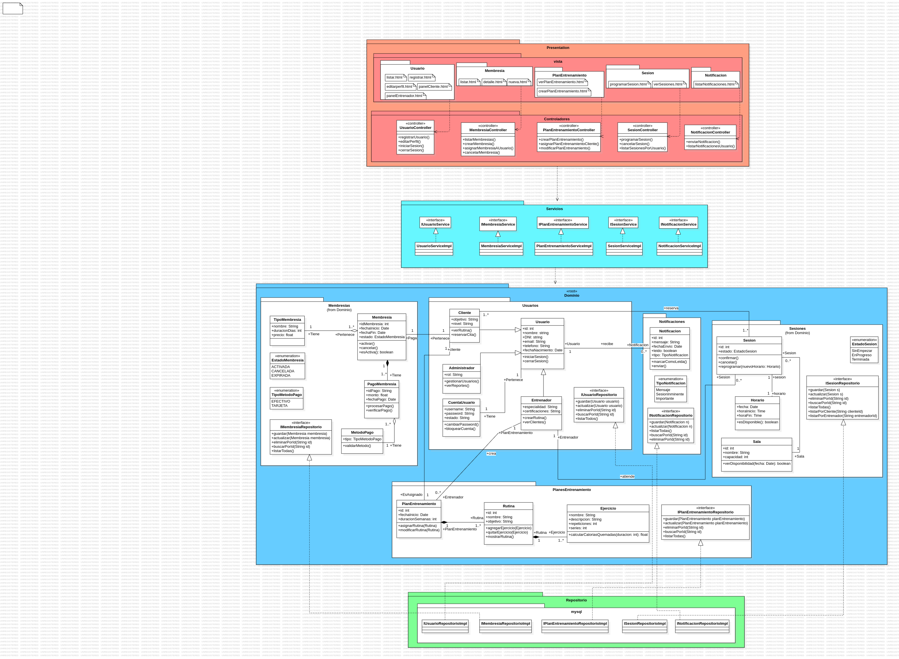

# Gimnasio App

1. Supo Molina Gerald Steve
1. Alva Cornejo Jose Javier
1. Palomino Rivadeneyra Misael Jesus
1. Chavez Medina Fernando Jesus
1. Zapana Pariapaza Gonzalo Rodrigo

## Proposito

Ayudar a tanto usuarios de gimnasios, entrenadores, y administradores de gimnasios a lograr una experiencia de entrenamiento
más fluida y personalizada, maximizando la eficiencia en el uso de
recursos del gimnasio.

## Funcionalidades

### Funcionalidades Generales (Sistema)  

- **Autenticación de usuarios mediante CuentaUsuario**:  
  - Iniciar sesión (username/password)  
  - Cambiar contraseña  
  - Bloquear cuenta  

### Cliente  

- Visualizar sus rutinas (`verRutina()`)  
- Reservar sesiones (`reservarCita()`)  
- Consultar planes de entrenamiento asignados  
- Recibir notificaciones (`Notificacion`)  
- **Consultar y gestionar membresía**:  
  - Ver estado, activación o cancelación de la membresía (`activar()`, `cancelar()`)  
  - Ver tipo de membresía (duración, precio)  
- **Pagar membresía**:  
  - Registrar método de pago (`validarMetodo()`)  
  - Realizar y verificar pago (`procesarPago()`, `verificarPago()`)  

### Entrenador  

- Crear rutinas (`crearRutina()`)  
  - Agregar/quitar ejercicios a rutinas (`agregarEjercicio()`, `quitarEjercicio()`)  
- Crear planes de entrenamiento (`PlanEntrenamiento`)  
  - Asignar rutina a un plan (`asignarRutina()`)  
  - Modificar rutina de un plan (`modificarRutina()`)  
- Ver lista de clientes (`verClientes()`)  

### Administrador  

- Gestionar usuarios del sistema (`gestionarUsuarios()`)  
- Ver reportes (`verReportes()`)  

### Gestión de Sesiones  

- Crear y administrar sesiones de entrenamiento (`Sesion`)  
  - Confirmar, cancelar o reprogramar sesión (`confirmar()`, `cancelar()`, `reprogramar()`)  
- Ver disponibilidad de salas (`verDisponibilidad()`)  
- Ver disponibilidad de horarios (`esDisponible()`)  

### Notificaciones  

- Enviar notificaciones a usuarios (`enviar()`)  
- Marcar notificaciones como leídas (`marcarComoLeida()`)  
- Clasificar por tipo de notificación (`TipoNotificacion`)  

### Rutinas y Ejercicios  

- Crear rutina personalizada con ejercicios  
- Agregar descripción, repeticiones, series por ejercicio  
- Calcular calorías quemadas por duración (`calcularCaloriasQuemadas()`)  

### Funcionalidades derivadas de atributos  

- Registrar datos personales (nombre, DNI, email, teléfono, fecha de nacimiento)  
- Definir objetivo y nivel del cliente  
- Definir especialidad y certificaciones del entrenador  
- Seguimiento de progreso por duración del plan de entrenamiento

