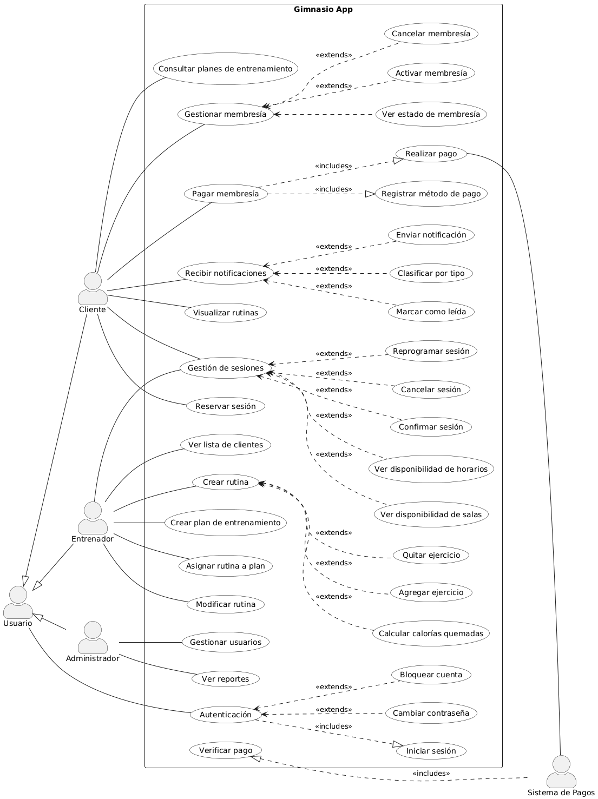
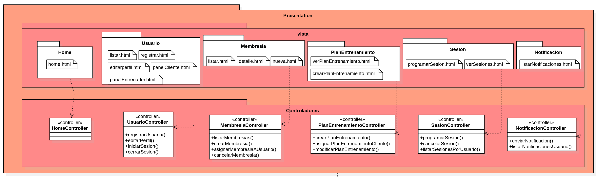
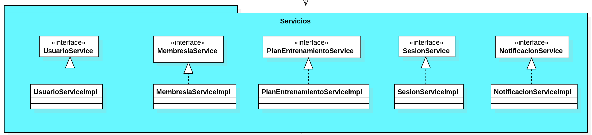
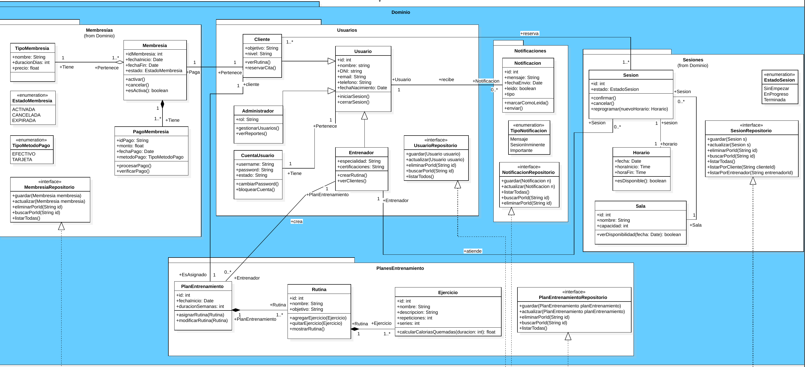
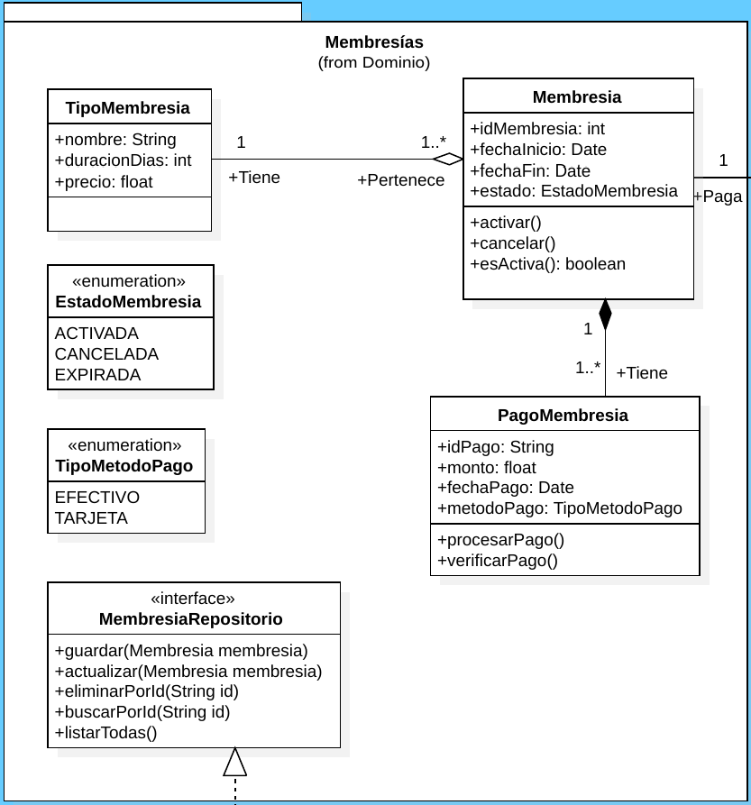
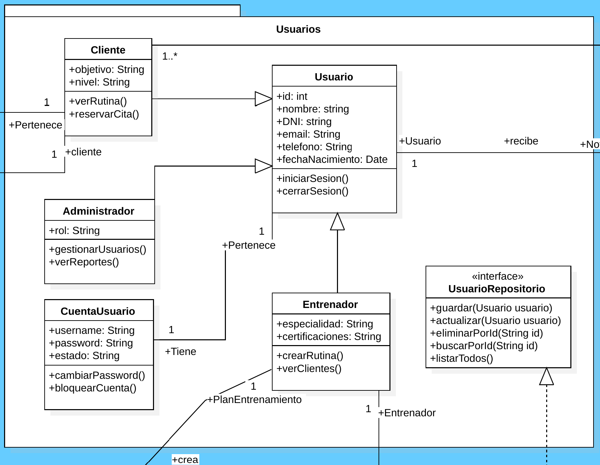
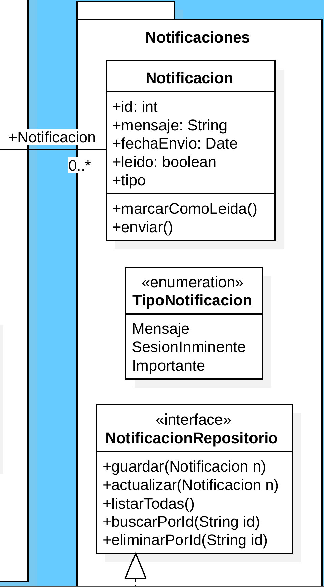
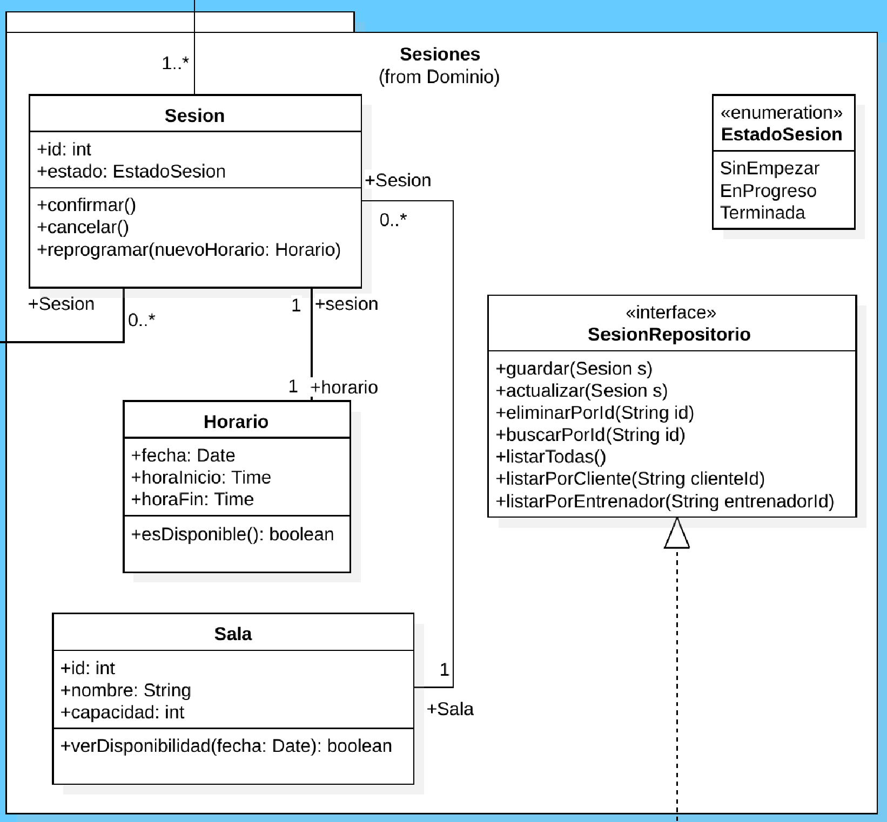
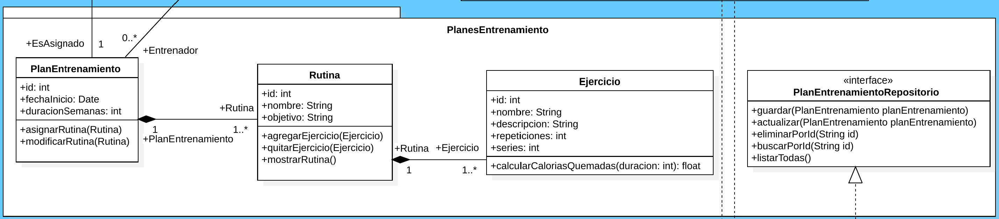
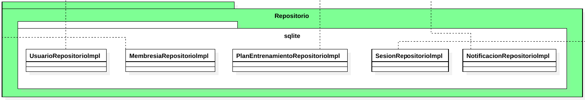

# Gimnasio App

## Proposito

Ayudar a tanto usuarios de gimnasios, entrenadores, y administradores de gimnasios a lograr una experiencia de entrenamiento
más fluida y personalizada, maximizando la eficiencia en el uso de
recursos del gimnasio.

## Users relevantes
### Entrenadores
| Usuario | Password |
|---------|----------|
| mariag  | abcdef   |
| davids  | 123abc   |
| sofiag  | welcome  |

### Clientes
| Usuario  | Password |
|----------|----------|
| joaquinf | ranger   |
| natalias | hockey   |
| ricardom | robert   |

### Admins
| Usuario   | Password |
|-----------|----------|
| ecastro   | elena    |
| dtorres   | david    |
| svillalba | sofive   |

## Diagrama casos de uso 
https://www.plantuml.com/plantuml/uml/dLNDZXit3BxFKn3RYtsmiUV2MCGnia4F0Le7pPsMkBDiDDA4bBO_JHweXnoAF89Vh9Qi32Q2QoGvpOZy-0r_-6cUQKI9QN2TeuS8CO1m_nZ1if2977odRzcFA3W0cXZaTVpJ4U3lf66WcJCf6LI2lpk0vsZUzXAIjxlWWi0Fz_VtsHp4abJJxUrjzw7h2YVygWc5Gptj79EFL4ylV1JoQ8DKmzOEx5cZ55iDXStxrMgAd1idWWRSy5JoczUiaGO4I_0pza5l01MgiHYwBdS6VUy8Rbxou54vm7OSRqhjYssAv2CRD7pyv9Sv75DyxA0yOBr-VmUBdpmRHW4bBQWVDnlsnYLBUdVt6RfPhs6nm-6GaIRuAAXq_1Spclw8v6qBVkx2kqGPdSZ71fYJsvFX0mlu4FcXv1WyQKcocBI3-d8cVE6V6EVmckp4sk1VePYIx130qV6ZnMledKCjl09Z48WyXZRbpoE5qy0MRrWJEluB1IH5zgZB1h4d9NcQDRRnxuBNv6B-e4DFciTCv_qOCYgq0Iz9imfGOA3X8AJ7ZzXYJcjnpLyRsy7_i9rxiJMHd-QEfdFNetVe3Rdl3dz30gGHRG1BNrJImONwwXBlgS_ooRxZFp6SWqViJqE4Pf-lSDI1bZXeTT3wLwj6Yp2Jztd2GjDwB2-ww_0lZhv1RvLxFz41bi0Bk5V1vZs-yk7IOiSQoyrYpjkXkRzDodKRUg7SCFgDnB3XHXUNWtv97ByrPeVE99SbYox8QJ0Axn8DQ55RANvvOJRgIEURLPSjRYfUQ0nIQwwHnqzb2aewNKFJeOFfjMOQ_0FBCDDsKru3BuhuMlIUHWczuDVIbueiwnWy7zYnHLigGOVwFO6FGKhxhbn_4q-xMtD7_S5bQ_dfP8gvO8hgIX9bNo_BxaFtZBnDW_iF


[//]: # (![image]&#40;https://github.com/user-attachments/assets/69462cb0-e1b8-4ef0-8be7-0fe12818f62f&#41;)











## Estilos de Programación y Arquitectura

### 1. Arquitectura Monolítica (en Capas)

#### Descripción
La aplicación sigue una **arquitectura monolítica en capas**. Esto significa que todo el código del proyecto (desde la interfaz de usuario -simulada por el controlador API-, la lógica de negocio, hasta el acceso a datos) reside en una única base de código y se despliega como una sola unidad.

A pesar de ser un monolito, internamente el código está bien organizado en distintas **capas lógicas** para separar las responsabilidades:

* **Capa de Presentación (`com.soft.gymapp.presentation.controladores`):** Maneja las solicitudes HTTP entrantes y las respuestas salientes. Es responsable de la comunicación con el cliente.
* **Capa de Servicio (Lógica de Negocio) (`com.soft.gymapp.servicio` y `com.soft.gymapp.servicio.impl`):** Contiene las reglas de negocio, validaciones complejas y la orquestación de operaciones. Aquí reside la "inteligencia" de la aplicación.
* **Capa de Repositorio (Acceso a Datos) (`com.soft.gymapp.repositorio` y `com.soft.gymapp.repositorio.sqlite`):** Se encarga de la interacción con la fuente de datos (en este ejemplo, una simulación en memoria). Define las operaciones CRUD (Crear, Leer, Actualizar, Eliminar).
* **Capa de Dominio (`com.soft.gymapp.dominio`):** Contiene las entidades de negocio (`Usuario`, `CuentaUsuario`, `Notificacion`) que representan los conceptos clave de la aplicación.

#### ¿Por qué esta elección?
Esta arquitectura es ideal para proyectos pequeños a medianos debido a su simplicidad en el desarrollo inicial, pruebas y despliegue. Mantiene una buena separación de preocupaciones internas sin la complejidad añadida de la comunicación entre múltiples servicios distribuidos.

#### Dónde verlo en el código:
* `src/main/java/com/soft/gymapp/presentation/controladores/UsuarioController.java`
* `src/main/java/com/soft/gymapp/servicio/UsuarioService.java` y `src/main/java/com/soft/gymapp/servicio/impl/UsuarioServiceImpl.java`
* `src/main/java/com/soft/gymapp/repositorio/UsuarioRepositorio.java` y `src/main/java/com/soft/gymapp/repositorio/sqlite/UsuarioRepositoriolmpl.java`
* `src/main/java/com/soft/gymapp/dominio/usuarios/Usuario.java` y `CuentaUsuario.java`

---

### 2. Estilo de Programación: Cookbook (Libro de Recetas)

#### Descripción
El estilo "Cookbook" (Libro de Recetas) es un patrón de diseño que consiste en descomponer un proceso o tarea compleja en una serie de **"recetas" o "pasos" más pequeños, atómicos y bien definidos**. Cada "receta" es un método auxiliar (a menudo privado) que realiza una parte específica de la tarea general. El método principal actúa como el "chef", que orquesta estas recetas en la secuencia correcta para completar la "comida" (la tarea completa).

Este estilo mejora la legibilidad, la mantenibilidad y la reusabilidad del código al hacer que cada paso sea explícito y fácil de entender.

#### ¿Dónde y cómo se aplica?

##### a) En la Capa de Servicio (`UsuarioServiceImpl`) - Lógica de Negocio:

Se ha aplicado el estilo Cookbook en el método `registrarUsuario` dentro de `UsuarioServiceImpl.java`. Este proceso complejo se divide en las siguientes "recetas":

* `receta_ValidarDatosRegistro()`: Se encarga de todas las validaciones de los datos de entrada del usuario.
* `receta_HashearContrasena()`: Realiza el proceso de hashing de la contraseña proporcionada.
* `receta_CrearEntidadUsuario()`: Construye y ensambla el objeto `Usuario` (incluyendo `CuentaUsuario`) a partir de los datos validados.
* `receta_GuardarUsuario()`: Persiste el objeto `Usuario` finalizado utilizando el repositorio.

El método `registrarUsuario` orquesta estas recetas para llevar a cabo el flujo completo de registro.

**Beneficios:** La lógica de registro es muy clara, paso a paso, y cada parte es un método aislado y probado.

#### Dónde verlo en el código:
* `src/main/java/com/soft/gymapp/servicio/impl/UsuarioServiceImpl.java` (Ver `registrarUsuario` y los métodos `private receta_*`)

##### b) En la Capa de Presentación (`UsuarioController`) - Formato de Respuesta:

Aunque la lógica principal se delega al servicio, se ha incluido una pequeña "receta" en el controlador para ilustrar cómo el estilo Cookbook puede aplicarse incluso a tareas más pequeñas y repetitivas a nivel de presentación:

* `receta_FormatearRespuesta()`: Un método privado que estandariza la estructura de las respuestas JSON que se envían al cliente, asegurando consistencia en el `status`, `message`, `data` y `errors`.

**Beneficios:** Garantiza un formato de respuesta API consistente, lo que facilita el consumo por parte de los clientes y mejora la claridad del controlador al separar la lógica de formato de la lógica de delegación.

#### Dónde verlo en el código:
* `src/main/java/com/soft/gymapp/presentation/controladores/UsuarioController.java` (Ver `receta_FormatearRespuesta` y cómo se usa en los métodos POST y GET).
 1. Cookbook Style (Estilo Recetario)
Descripción: Métodos diseñados como recetas reutilizables y encapsuladas, que realizan tareas específicas sin depender del contexto externo.

Aplicación:
El método calcularCaloriasQuemadas(int duracion) representa una unidad autocontenida de lógica, fácil de reutilizar:

```java
/**
 * Calcula una estimación de calorías quemadas en base a la duración del ejercicio.
 * @param duracion duración del ejercicio en minutos
 * @return calorías quemadas (estimadas)
 */
public float calcularCaloriasQuemadas(int duracion) {
    // Por ahora se retorna la duración como valor de calorías para propósitos de ejemplo.
    return duracion;
}
```
2. Lazy-River Style (Estilo Río Perezoso)
Descripción: Procesamiento controlado y eficiente de datos, evitando cálculos innecesarios, comúnmente aplicado con estructuras como StringBuilder o flujos de datos.

Aplicación (Implícita):
Aunque no se usa explícitamente StringBuilder en esta clase, se observa una intención de procesamiento seguro y paulatino en los setters mediante validaciones antes de modificar los datos. Ejemplo:

public void setNombre(String nombre) {
    if (nombre != null && !nombre.trim().isEmpty()) {
        this.nombre = nombre.trim();
    }
}

3. Things Style (Objetos como Cosas del Dominio)
Descripción: Las clases representan fielmente elementos del dominio del problema, con atributos y comportamientos propios.

Aplicación:
La clase Ejercicio es una representación directa del concepto de ejercicio físico en el dominio del gimnasio. Cuenta con propiedades como nombre, descripcion, repeticiones, series, y una relación con Rutina:

@Entity
@Table(name = "ejercicio")
public class Ejercicio {
    @Id
    private Integer id;

    private String nombre;
    private String descripcion;
    private int repeticiones;
    private int series;

    @ManyToOne
    private Rutina rutina;

    // Métodos relevantes...
}
Esto permite un diseño orientado al dominio, claro y escalable.

## Practicas Clean Code
### Nombres
```java
public void cambiarPassword(String nuevaPassword, String passwordActual);
```

### Funciones
#### Responsabilidad unica
```java
public void cambiarPassword(String nuevoPassword, String actualPassword) {
    validarPassword(actualPassword);
    validarNuevoPassword(nuevoPassword);
}
```

### Comentarios
```java
/*
* Nueva contrasenia debe cumplir requisitos de longitud y seguridad
*/
private void validarNuevoPassword(String nuevoPassword);
```
### Estructura de Código Fuente 
#### Agrupacion de campos y metodos
```java
// Constantes
private static final int LONGITUD_MINIMA_PASSWORD = 6;

// Campos
private String username;
private String password;
private EstadoCuentaUsuario estado;

// Logica interna
private void validarNuevoPassword(String nuevoPassword);
private void validarPassword(String password);

// API
public void cambiarPassword(String nuevoPassword, String actualPassword);
public void bloquearCuenta();

// Getters/Setters
/*...*/


```

### Objetos/Estructura de Datos 
#### Uso de enums en lugar de strings
```java
public enum EstadoCuentaUsuario {
    ACTIVA, INACTIVA, BLOQUEADA
}
```
### Tratamiento de Errores
#### En validacion de credenciales
```java
if (nuevoPassword.length() < 6) {
    throw new IllegalArgumentException("Contrasenia muy corta");
}

if (nuevoPassword.equals(password)) {
    throw new IllegalArgumentException("Contrasenia identica a anterior");
}
```
### Clases
#### En cumplir el criterio de Responsabilidad única y Cohesión. Igual aplica separación de responsabilidades y la importancia de las interfaces
```java
public interface UsuarioRepositorio {
void guardar(Usuario usuario);
void actualizar(Usuario usuario);
void eliminarPorId(int id);
Optional<Usuario> buscarPorId(int id);
List<Usuario> listarTodos();
Optional<Usuario> buscarPorEmail(String email);
Optional<Usuario> buscarPorDNI(String DNI);
}
```

## Principios SOLID
### Principio de Responsabilidad Unica
Los repositorios del proyecto tienen como unica funcion el acceso a datos, junto con algunas consultas
un tanto derivadas(acceder a objeto de valor TipoMembresia desde repositorio Membresia).
```java
public interface MembresiaRepositorio extends JpaRepository<Membresia, Integer> {
    List<Membresia> findByTipoNombreContainingIgnoreCase(String nombre);
    List<Membresia> findByTipoPrecioLessThan(float precioMaximo);
    List<Membresia> findByTipoDuracionDiasGreaterThanEqual(int diasMinimos);
}
```

### Principio de Abierto/Cerrado
Dicho repositorio puede extenderse a funcionalidades/consultas nuevas y mas complejas,
pero no se modifica las proporcionadas por JPA.
```java
public interface MembresiaRepositorio extends JpaRepository<Membresia, Integer> {
    List<Membresia> findByTipoNombreContainingIgnoreCase(String nombre);
    /* ... */
}
```

### Principio de Sustitucion de Liskov

### Principio de Segregacion de Interfaces

### Principio de Inversion de Dependencias
Aplicado en UsuarioServiceImpl (módulo de alto nivel), no depende de la implementación concreta de UsuarioRepositoriolmpl
(módulo de bajo nivel/detalle). En su lugar, depende de la abstracción UsuarioRepositorio a través de la inyección por
constructor (o @Autowired en este caso).
```java
// UsuarioServiceImpl (alto nivel) depende de la abstracción UsuarioRepositorio
@Autowired
private UsuarioRepositorio usuarioRepositorio; // Depende de la interfaz, no de la implementación específica
```
### Test
